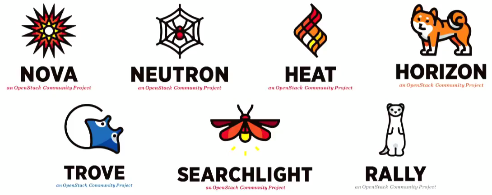
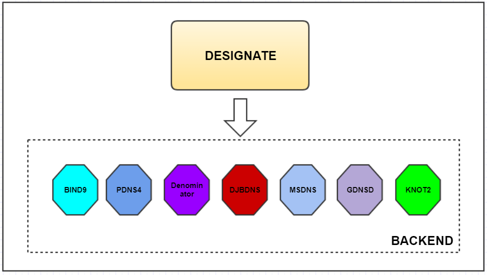
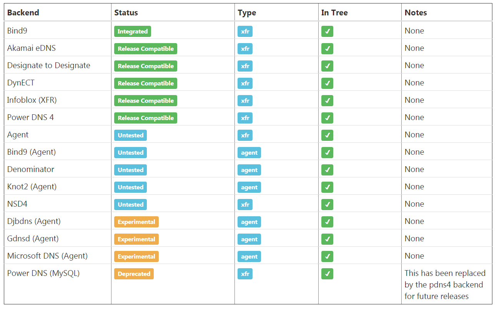
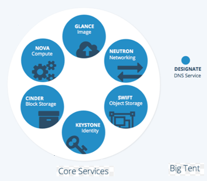
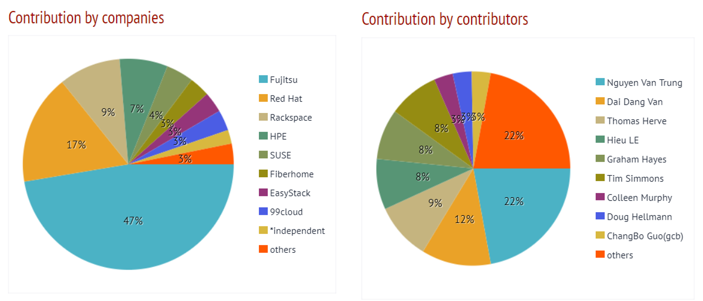

# OPENSTACK DESIGNATE - Một phút suy ngẫm để hướng tới tương lai.

## I. OPENSTACK DESIGNATE là gì?

Đây là nguyên văn định nghĩa của Designate trên trang chủ của Openstack:

**“Designate is a multi-tenant DNSaaS service for OpenStack. It provides a REST API with integrated Keystone authentication. It can be configured to auto-generate records based on Nova and Neutron actions. Designate supports a variety of DNS servers including Bind9 and Powers.”**

Đây là một khái niệm cực kỳ chung chung để nói về những công dụng của Designate, vì vậy để hiểu hết được tính năng cũng như công dụng của nó thì cần phải có thời gian nghiên cứu với code-base và thực tế bắt tay vào cài đặt và thử nghiệm trên một lab với một vài DNS servers (backend) như BIND9 hay Pdns4.

Dưới đây là kinh nghiệm của tôi sau một thời gian thử nghiệm, cũng như **contribute** vào Designate project như sau:

### 1. Khái quát về Designate project:

#### a. Designate là gì?

 
**Designate là Domain Name System as a service (DNSaaS)**. Designate không phải là một DNSServer, đây là một project được sinh ra để quản lý tập trung các DNServers, thông qua Designate chúng ta chỉ cần tạo, sửa, xóa các bản ghi về *zone*, *records*, sau đó sẽ tự động kết nối và thực hiện cập nhật đến tất cả các DNSServers đang kết nối đến Designate. Với giải pháp này sẽ tránh được việc lên từng DNSServer để cấu hình, giúp tiết kiêm thời gian, nhân lực và tăng hiệu quả kinh tế.

Ngoài ra, Designate có thể cho phép tích hợp với một số project Lõi trong Openstack như Neutron, Nova, Heat, …

Dưới đây là dẫn lời từ trang chủ của Openstack:

 
*Note: designate-sink service đã trở thành service tùy chọn (optional), với kiến trúc hiện tại thì Designate có thể lắng nghe trực tiếp thông qua designate-api service.*

#### b. Designate được sử dụng để làm gì?

Như phần khái quát, tôi cũng đã đề cập đến 2 cụm tính năng chính của Designate, đó là quản lý tập trung các DNSServers và tích hợp với các project khác trong Openstack. Trong phần này tôi xin đề cập đến một chức năng chính đó là quản lý các DNSServers.

Dựa vào topology của Designate dưới đây, chúng ta cũng có thể hiểu được Designate được sử dụng để làm gì:
 

Designate cung cấp tính năng kiểm soát nhiều DNSServers tại cùng một thời điểm, các bản ghi sẽ được khởi tạo trong Designate và lưu trữ lên cơ sở dữ liệu của Designate. Sau đó, thông qua designate-worker service sẽ tương tác trực tiếp với các DNSServers để thực hiện việc cập nhật các bản gi đó vào các DNSServers. Quá trình đồng bộ từ Designate vào DNSServer sẽ diễn ra theo một chu kỳ nhất định (do người sử dụng cài đặt trên designate.conf file), qua đó các DNSServers sẽ nhận được các bản ghi đã được cập nhật mới nhất từ Designate.  

Hiện tại, Designate đang hỗ trợ để quản lý tập trung các DNSServers (như hình vẽ), cụ thể như: BIND9, PDNS4, Denominator, Djbdns, Msdns, Gdnsd, Knot2, nsd4, dynect và designate. Tuy nhiên, theo thống kê mới nhất thì chỉ có BIND9 đã được tích hợp và được kiểm tra qua OpenStack CI Infrastructure. Vì vậy, việc cần làm là đảm bảo cho các DNS server còn lại hoạt động ổn định và có thể vượt qua bài test của OpenStack CI Infrastructure trong tất cả các commit.

Dưới đây là thống kê từ nhà phát triển Designate:

#### c. Designate ở đâu trong Openstack?

Openstack có 6 Core projects, gồm Nova, Neutron, Glance, Cinder, Keystone và Swift. Như vậy, Designate là một project con được tích hợp vào Openstack với 2 tính năng chính, đó là:

- Kết nối với Neutron để lấy thông tin bản ghi floating-ip.
- Lắng nghe tất cả cả các *notification* được bắn ra từ các projects khác trong openstack, như Nova. Đối với các projects khác thì cần test và xác nhận lại từ Core-reviewer.

Designate là một service được xếp vào nhóm Network service trong Openstack cùng với Neutron project.

### 2. Kiến trúc tổng quan của Designate project

Cũng như tất cả các projects khác trong Openstack thì Designate cũng đã và đang sử dụng chung các công nghệ, giao thức hiện có của Openstack, như: Remote Procedure Call (RPC), Message Queue (MQ), SQLAlchemy engine để kết nối các thành phần, các services lại với nhau.

Dưới đây là mô hình tổng quan của Designate (theo dữ liệu mới nhất từ Openstack):

Đây là mô hình được sử dụng từ Newton cycle, với hai services được thay thế từ pool-manager và zone-manager thành worker và producer. Designate có 5 services chính, đó là:

Ngoài ra còn một số các services tùy chọn như:
- designate-agent
- designate-sink

Note:
- Designate có hỗ trợ để lưu trữ lên NoSQL (tuy nhiên, chưa có xác nhận chính xác và kiểm nghiệm cho tính năng này)
- designate-central service sẽ tương tác trực tiếp với cơ sở dữ liệu (DB)
- designate-worker service sẽ tương tác với DNS servers

## II. DESIGNATE trong OPENSTACK hiên nay?

### 1. Thực trạng của Designate:

Phần I là giới thiệu cơ bản về Designate project, tiếp theo đây là những gì đang diễn ra với Designate trong cộng đồng Openstack.

Theo thống kê mới nhất từ PTL (Graham-mugsie) trên blog của ông <http://graham.hayes.ie/posts/openstack-designate-where-we-are/> và <http://stackalytics.com/> thì số lượng **Commits per cycle** đã giảm một cách đáng kể từ Havana Cycle đến nay, cụ thể như sau:

<table border="1" class="docutils">
<caption>Commits per cycle</caption>
<colgroup>
<col width="65%">
<col width="40%">
</colgroup>
<tbody valign="top">
<tr>
<td>Havana</td>
<td>172</td>
</tr>
<tr>
<td>Icehouse</td>
<td>165</td>
</tr>
<tr>
<td>Juno</td>
<td>254</td>
</tr>
<tr>
<td>Kilo</td>
<td>340</td>
</tr>
<tr>
<td>Liberty</td>
<td>327</td>
</tr>
<tr>
<td>Mitaka</td>
<td>246</td>
</tr>
<tr>
<td>Newton</td>
<td>299</td>
</tr>
<tr>
<td>Ocata</td>
<td>98</td>
</tr>
<tr>
<td>Pike</td>
<td>95</td>
</tr>
</tbody>
</table>

Trong Pike cycle dưới đây là thống kê mới nhất về số lượng công ty và contributor đã đóng góp vào mã nguồn mở của Designate như sau:

 	 

Qua đó, chúng ta thấy *Fujitsu* đang rất quan tâm đến Designate và ứng dụng nó vào hệ thống Cloud K5 của mình. Đây có thể sẽ là một key project của *Fujitsu* để tập trung sử dụng và phát triển các dịch vụ trên nền của Designate.

Những gì chúng ta cần quan tâm trong biểu đồ này là số lượng công ty và **contributors** ngoài *Fujitsu* là rất ít và không đáng kể, điều này cho thấy sức thu hút để phát triển project đã suy giảm rất trầm trọng và có nguy cơ không còn **contributors** trong tương lai nếu *Fujitsu* không nhìn thấy tiềm năng và sự phát triển của Designate để tiếp tục đầu tư. Cũng như trong các buổi IRC meeting hàng tuần vào 17:00(UTC) thứ 4, gần như chỉ có **contributors** từ *Fujitsu* tương tác với PTL (timsim) và Cựu PTL(mugsie).

Với những gì đang diễn ra, nếu không có những chính sách kịp thời thì Designate project có thể sẽ không còn là project chính thức của Openstack nữa (official project). Đây sẽ là tổn thất rất lớn cho các công ty đã và đang sử dụng Openstack nói chung và tính năng DNSaaS nói riêng.

### 2. Tại sao Designate lại rơi vào hoàn cảnh như hiện tại và định hướng trong tương lai như thế nào?

Đối với 1 project trong Openstack, người ta sử dụng thước đo bằng **activity** qua từng chu kỳ (cycle) của mỗi project để đánh gía được project đó đang phát triển, sự quan tâm và sử dụng từ cộng đồng hay không. Đối với Designate thì **activity** ở Pike cycle chỉ còn gần ¼ so với Kilo cycle.

Như phần đầu tôi đã đề cập, Designate chưa khẳng định được sự hiệu quả của mình để thu hút các công ty đầu tư vào để sử dụng và phát triển. Bên cạnh đó, Designate cũng không thu hút được nhiều **contributors** tham gia đóng góp vào mã nguồn mở của mình.

Theo quan điểm cá nhân tôi thì có một số điểm như sau đã và đang ảnh hưởng đến Designate:

- Hiện tại thì PTL và Core-reviewer không còn được trả Tiền để duy trì và phát triển cho Designate project, theo lời của cựu PTL đã nói: “We are now one corporate change of direction from having no cores on the project being paid to work on the project”. Tuy nhiên, theo thông tin mới nhất qua IRC meeting thì Graham sẽ qua trở lại với chức danh PTL từ Queen cycle và sẽ dành full-time để dẫn dắt Designate (đây là một tin cực vui cho Designate team) quay trở lại với quỹ đạo.

- Số lượng Core-reviewer gần như là 0, vì vậy nó gây ra rất nhiều khó khăn trong việc kiểm thử và xem xét các tính năng mới phát triển từ **contributors**.

- Designate vẫn mang phong cách cá nhân hóa để sử dụng cho công ty HPE, đây là công ty cũ của cựu PTL làm việc. Có một số patch-set tôi đẩy lên để thay đổi nhưng đã bị từ chối vì HPE đang sử dụng và không muốn thay đổi (như định dạng trường dữ liệu, tính năng centralize-config, …).

- Designate đang đi chệch đường ray của Openstack do vẫn giữ lại những thiết kế cũ về Object, Config, Project Architecture. Đây là yếu tố quan trọng gây ra nhiều khó khăn khi **contributors** muốn nhảy từ một project khác trong Openstack vào Designate và muốn nắm bắt một cách nhanh chóng và dễ dàng. Với một Project Architecture được thiết kế lâu đời, không có sự cải thiện và không đồng nhất trong Openstack thì sẽ mất rất nhiều thời gian để **contributors** mới bắt đầu tìm hiểu. Như vậy, sẽ có rất ít **contributors** đủ kiên nhẫn để làm việc này. Chúng tôi (*Fujitsu*) đã đề xuất và triển khai các patch-sets liên quan đến Oslo.Versioned Object (OVO) và Online schema migration (OSM) (giai đoạn 1 - Objects tương tác với cơ sở dữ liệu), nhằm đưa Project Architecture đồng bộ với Openstack. Bên cạnh đó, chúng tôi cũng đã có kế hoạch để phát triển nó nếu như giải pháp được đồng ý.

- Designate chưa kiểm thử hết các DNSServers đã và đang hỗ trợ trong code-base. Đối với vấn đề này, rất cần các **Operators** đã và đang triển khai cung cấp tài liệu và kết quả vào Designate docs. 

- Designate chưa đạt độ ổn định cao, xuất hiện nhiều *Bugs* trong quá trình triển khai. <https://bugs.launchpad.net/designate>

- Một số tính năng cần phát triển và cải thiện chức năng theo dự định đang bị trì hoãn, đó là:

  -	Control Plane API endpoints deployment via WSGI
  -	Python 3.5 functional testing
  -	Mixed Driver environments (one pool using powerDNS, one using Bind) 
  -	Multi DNS Server environments 
  -	Upgrade testing

- Sự tương tác giữa Designate và các project khác trong Openstack là rất hạn chế.

- Tài liệu cho người sử dụng (Operators) và developer còn sơ sài, không bao trùm hết các trường hợp sử dụng trong thực tế. Đây là yếu tố then chốt làm người dùng gặp nhiều khó khăn khi triển khai và tương tác với Designate.

Trên đây là một số quan điểm của tôi về tình trạng của Designate, để giải quyết tất cả các bài toàn đó cần phải có thời gian và một PTL tâm huyết (tôi nghĩ từ Queen, chúng ta sẽ có cái này, ^_^). Bản thân tôi có thì việc cung cấp các tài liệu rõ ràng nên được ưu tiên hàng đầu, thứ hai là việc đồng bộ với Openstack project (kiểm thử với giải pháp OVO, OSM và centralize-config của *Fujitsu* đã triển khai và đề xuất) và thứ 3 là phát triển các tính năng liên quan đến tích hợp với các project khác trong Openstack.

Bên cạnh đó, chúng ta cũng có thể kêu gọi các **contributors** và **Operators** qua MailList của Openstack.

Cá nhân tôi sẽ tiếp tục **contribute** vào Designate và phát triển 1 vài tính năng gồm:

- Viết docs về "How to use the Designate in HA topology"
- Nghiên cứu để tích hợp thêm một số DNSServers mới vào Designate.
- Phát triển tính năng kiểm tra tình trạng DNSServers và các bản ghi trên tất cả các DNSServers kết nối đến Designate.

Cheer!

Author: Nguyễn Văn Trung <trungnv@vn.fujitsu.com>
