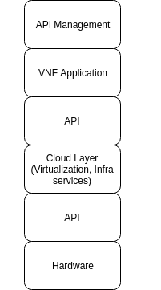
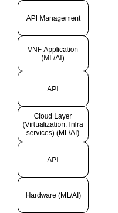

Trong Telco Cloud Architect, ta sẽ chia thành các khối chính, đó là SDDC (Software Defined Data Center) Architect, VNF Architect, Container Framework và Cloud Infrastructure Management. Thực ra, kiến trúc này ta hoàn toàn có thể áp dụng cho các kiến trúc cloud khác, không nhất thiết phải trong Telco. Ví dụ, các VNF ta hoàn toàn có thể thay thế bằng các Cloud App. Trong series này ta sẽ cùng nhau định nghĩa từng khối để làm rõ vai trò, chức năng từng thành phần trong đó.

#### Toàn cảnh sự phát triển của "stack"

Ta sẽ nhìn câu chuyện này dưới góc độ "stack" như sơ đồ dưới đây:

Traditional Stack -> Virtualization Stack -> Cloud Stack -> Programmable Stack -> Self-Operated Stack

3 stack đầu tiên có lẽ ta không cần thiết phải bàn đến. OpenStack được sinh ra cho Cloud Stack, vậy nó khác gì với Programmale Stack? Đó chính là các lớp APIs. Trong Cloud Stack, Cloud layer sẽ là lớp phía trên của hardware, cung cấp ảo hóa cũng như các tác vụ (operations) liên quan đến ảo hóa cho phần hardware phía dưới. Các bạn có thể lấy các chức năng của OpenStack để hình dung cho vấn đề này hoặc ta có thể hình dung các VNF sẽ được triển khai trên các máy ảo được sinh ra bởi Cloud Layer. Tuy nhiên, nếu chỉ ứng dụng Cloud Layer đơn thuần thì sẽ thiếu sự linh hoạt (flexibility) và sự tối ưu hóa. Chính vì thế tại Programmable, các lớp API sẽ làm lớp trung gian giữa Cloud Layer với hardware cũng như VNF:

Các bạn có thể thấy rằng, việc đưa các API vào giữa các lớp của Cloud Stack sẽ làm cho người dùng có thể kiểm soát tùy ý một cách dễ dàng. Đơn cử một trong những API giữa Cloud Layer với HW chính là SDN (Software Define Network), hoặc VNFM chính là nơi cung cấp API giữa Cloud Layer và VNF APP.

Vậy, Self-Operated Stack là gì?

Self-Operated Stack = Programmable Stack + ML/AI (Machine Learning/Artificial Intelligence). Tức là thế này:

To be continued ...

Tutj/VietStack

